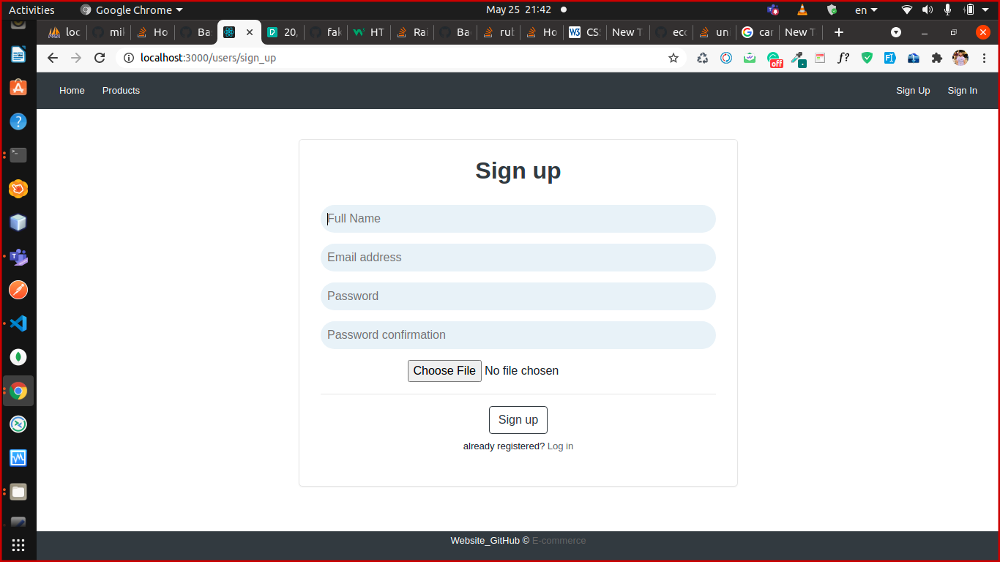
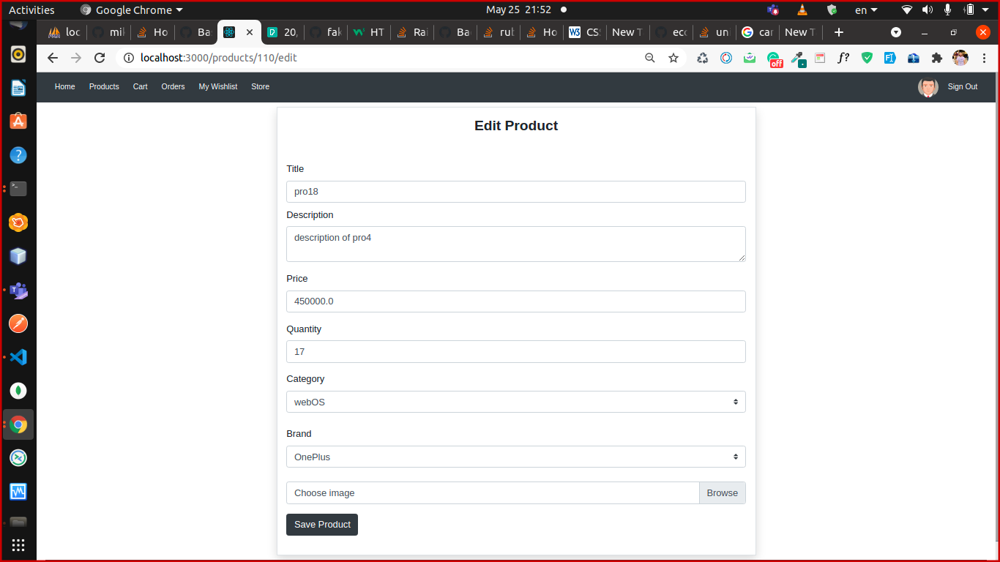

# Ruby E-Commerce Website

## Website Functionality
This is a team project that features an ecommerce website with different roles (admin, seller, buyer , guest) using Ruby on Rails.

## what you can do
* All roles can view products, its price and details.
* As buyer, you can add products to your cart and order all selected products with all requirements to finish order delivery process, rate the product and write a review on it, etc ..
* As seller, you act as a buyer in addition to add new products and change the order states.

* As admin, you have all permisions in the system.

### Team Members:
	 Ahmed Mahmoud - Bassam saad - Islam Shaaban - Kaled elgaml - Hossam Salah - Mohamed egila

### Prerequisites

Install node.js, ruby, rails

### Installing
1. Download the zipped file and unzip it or Clone it
	```sh
	git clone https://github.com/BassamSaadElsafy/Ecommerce-Rails.git
	```
2. change directory inside the project
    ```sh
    cd Ecommerce-Rails
    ```
3.  Run this command to install all gems we used
    ```sh
    bundle install
    ```
4. run this command to create your database
    ```sh
    rake db:create db:migrate
    ```
5. seed the database - generate fake test data
    ```sh
    rails db:seed
    ```
6. Start your server
    ```sh
    rails server
    ```
7. Open your browser on this url [http://localhost:3000](http://localhost:3000)

# Demo
Try our Website on Heroku [https://itiecommercerails.herokuapp.com/](https://itiecommercerails.herokuapp.com/)
 with this authentication parameters in sign-in page

1. Admin Email
    ```sh
    admin@admin.com
    ```
1. Admin Password
    ```sh
    123456
    ```
# Screenshots

## Database Structure (ERD)


## Front-End Design







